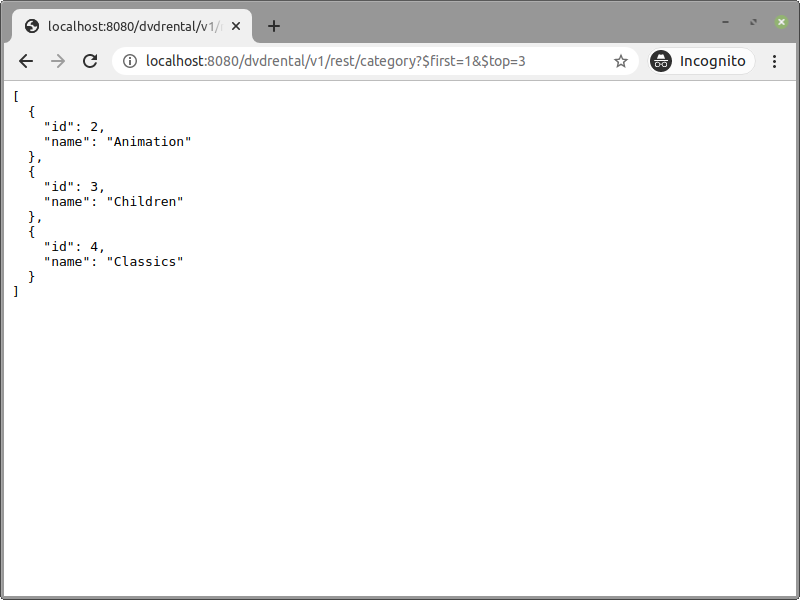
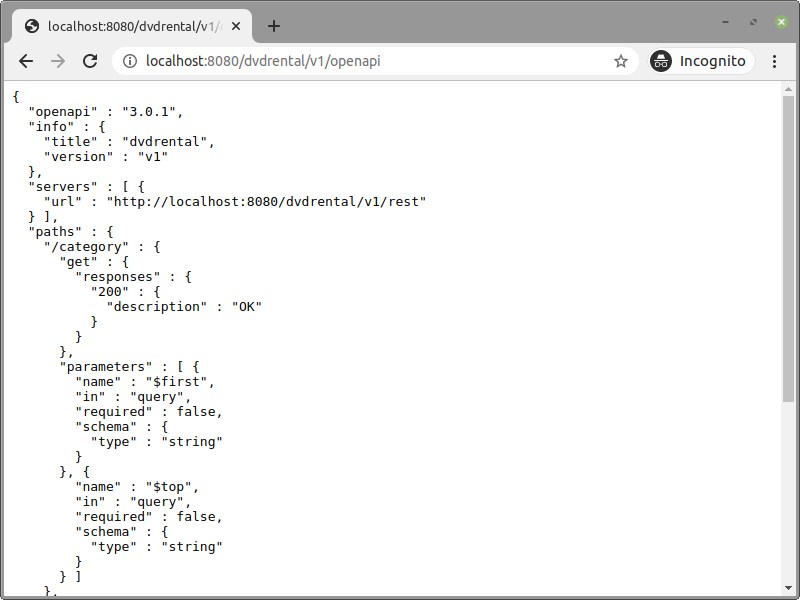
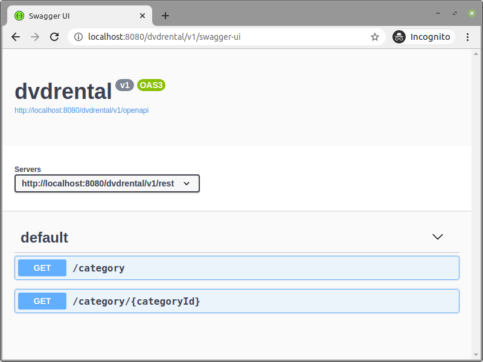

**Declare** your service
{: .mt-5 }
```java
service dvdrental

version v1
```

**Specify** its API
{: .mt-5 }
```java
api service dvdrental version v1

path "/category"
  query parameter $first
  query parameter $top

path "/category/" categoryId
  path parameter categoryId	
```

**Implement** it
{: .mt-5 }
```java
implementation service dvdrental version v1

path "/category"
  datasource dvdrental

  query "select category_id as id, 
	            name 
           from category
          limit coalesce(cast(" $top " as integer), 100) 
         offset coalesce(cast(" $first "as integer), 0)"

path "/category/" categoryId
  datasource dvdrental

  query "select category_id as id, 
                name 
           from category
          where category_id = cast(" categoryId " as integer)"
```

**Define** its datasource
{: .mt-5 }
```java
datasource dvdrental
  driver "org.postgresql.Driver"
  url "jdbc:postgresql://localhost:5432/dvdrental"
  user "postgres"
  password "postgres"
```

**Run** it
{: .mt-5 }
```shell
docker run -it --rm -v $(pwd):/projects -p 8080:8080 marimplatform/runtime
```

**Be Happy!** 
{: .mt-5}
1\. Your service is ready at `http://localhost:8080/dvdrental/v1/rest`


{: .text-center}

{: .mt-5 }
2\. Its [Open API](https://www.openapis.org/) specification is at `http://localhost:8080/dvdrental/v1/openapi`


{: .text-center}

{: .mt-5}
3\. You can view it in a human-friendly way through the integrated [Swagger UI](https://swagger.io/tools/swagger-ui/) application at `http://localhost:8080/dvdrental/v1/swagger-ui`


{: .text-center}
